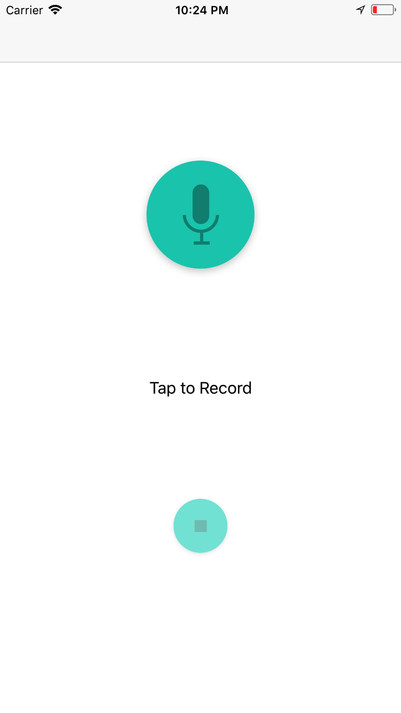
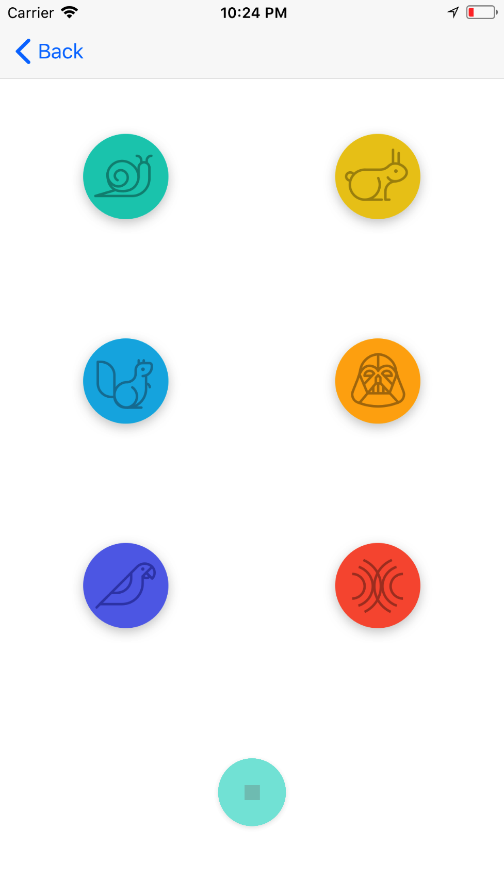
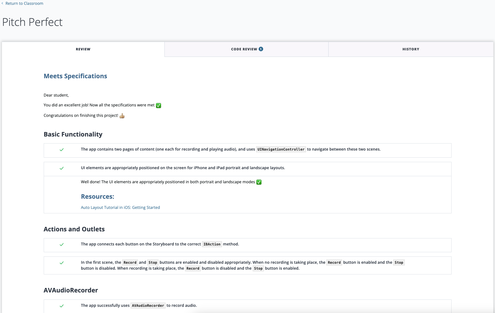

# Pitch Perfect

### Udacity Project 1: Pitch Perfect iOS Developer Nanodegree

A simple AVFoundation app that uses your phone's microphone to record audio and then apply audio effects on the recording: slow speed, high speed, low pitch, high pitch echo, and reverb.

Basic features Based on the criteria found in here:

- [Project Rubric](https://docs.google.com/document/d/1LlcUT90j-ItbRQpB3ivLHwjP-KgKOUdoOLpz0WirpSo/pub?embedded=true)

|Home|Sound Effects|Reviewer Remark|
|--|---|----------------------|
|| | 
|

## Implementation

Pitch Perfect has two Scenes:

- **RecordSoundsViewController** : consists a record button with a microphone image. Tapping this microphone button starts an audio recording session and present a stop button. When the stop button is clicked, the app completes recording and then show the PlaySound controller.
- **PlaySoundsViewController** : contains six buttons to play the recorded sound file with different effects related to the button image and a stop button at the bottom. These buttons give plays the recorded audio with vareious sound effects.

The application uses code from `AVFoundation` to record sounds from the microphone `(AVAudioRecorder)` and play recorded audio with effects `(AVAudioPlayer, AVAudioEngine)`.

## Requirements

- Xcode 10
- Swift 4.2
